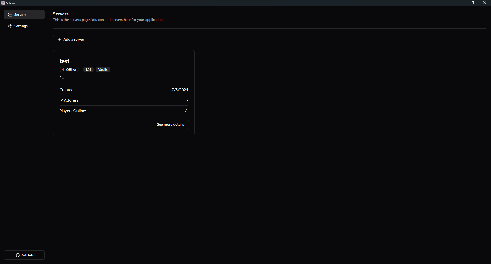
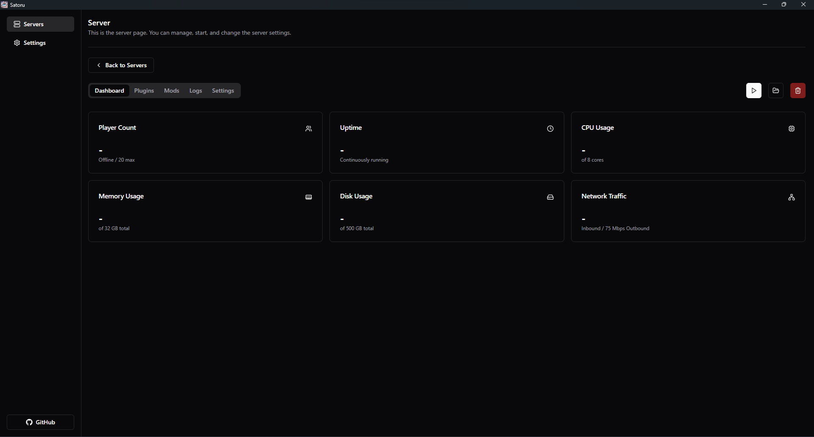

# Satoru

Manage your Minecraft Servers easily with Satoru.




## Features

- ✅: Supported
- 🚫: Not in progress
- ⌛️: In progress
- ⚠️: Partially supported (with some caveats)

| Feature | Status |
| -------- | ------- |
| Create a new server | <span aria-label="Supported" role="img">✅</span>
| Delete a server | <span aria-label="Supported" role="img">✅</span>
| Start a server | <span aria-label="Supported" role="img">✅</span>
| Stop a server | <span aria-label="Supported" role="img">✅</span>
| Open server folder | <span aria-label="Supported" role="img">✅</span>
| Vanilla software | <span aria-label="Supported" role="img">✅</span>
| Spigot software | <span aria-label="Supported" role="img">✅</span>
| CraftBukkit software | <span aria-label="Supported" role="img">✅</span>
| Backup servers | <span aria-label="Not in Progress" role="img">🚫</span>
| Add plugins | <span aria-label="Partially supported" role="img">⚠️</span>
| Add mods | <span aria-label="Partially supported" role="img">⚠️</span>
| Read server logs | <span aria-label="Supported" role="img">✅</span>
| Run commands | <span aria-label="In Progress" role="img">⌛️</span>
| Track system resources | <span aria-label="In Progress" role="img">⌛️</span>
| Manage server settings | <span aria-label="Supported" role="img">✅</span>
| Minecraft Bedrock | <span aria-label="Not in Progress" role="img">🚫</span>
| Whitelist | <span aria-label="Not in Progress" role="img">🚫</span>

## How to use

### Prerequisites

- [Node.js](https://nodejs.org)
- [pnpm (package manager)](https://pnpm.io/installation)
- [Rust and system dependencies](https://tauri.app/v1/guides/getting-started/prerequisites)

### Steps

1. Clone the repository

```bash
git clone https://github.com/fellipeutaka/satoru.git
```

2. Install the dependencies

```bash
pnpm install
```

3. Run the project

```bash
pnpm tauri dev
```